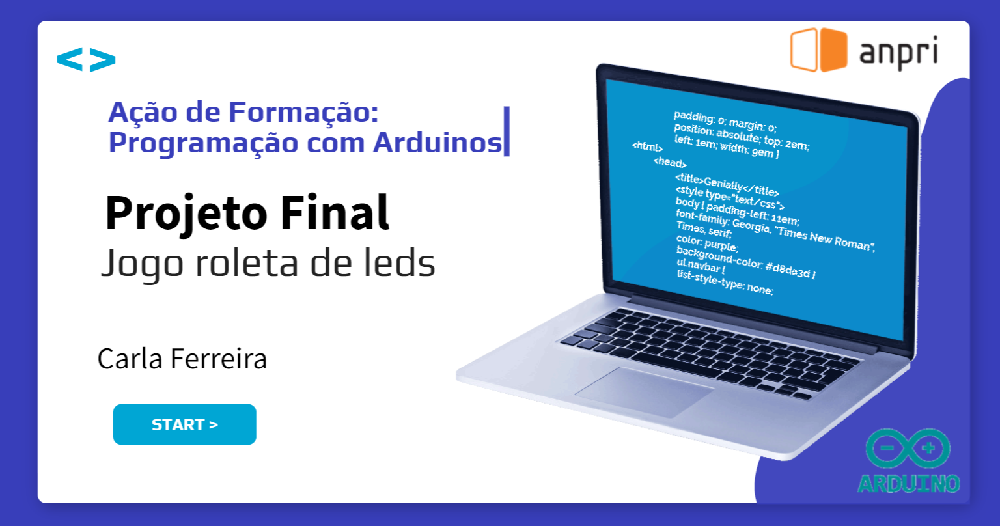

# Jogo Roleta de Leds

<a href="https://view.genial.ly/660eef0ddeffd10014753dec/learning-experience-didactic-unit-projeto-final-carla-ferreira">

  
Link para vídeo

</a>

  Projeto desenvolvido no âmbito da ação de formação - <b>Programação com Arduinos da ANPRI</b> (Associação de Professores de Informática) 
  <b>Créditos:</b> Carla Ferreira

