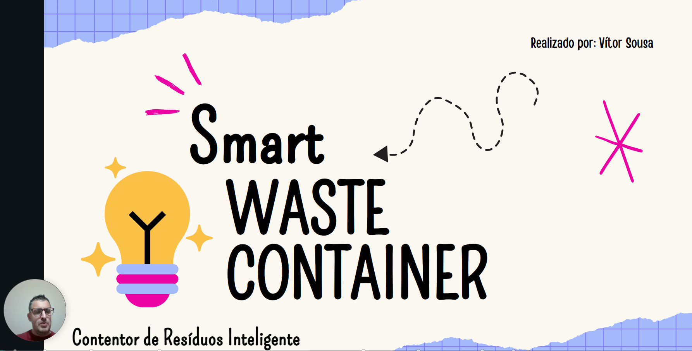

# Smart Waste Container

<a href="https://www.canva.com/design/DAGB8aoD7aU/xIOOB8hpHVmWXVFqqoH3cw/view?utm_content=DAGB8aoD7aU&utm_campaign=designshare&utm_medium=link&utm_source=recording_view">

  
Link para vídeo

</a>

  Projeto desenvolvido no âmbito da ação de formação - <b>Programação com Arduinos da ANPRI</b> (Associação de Professores de Informática) 
  <b>Créditos:</b> Vera Freitas

