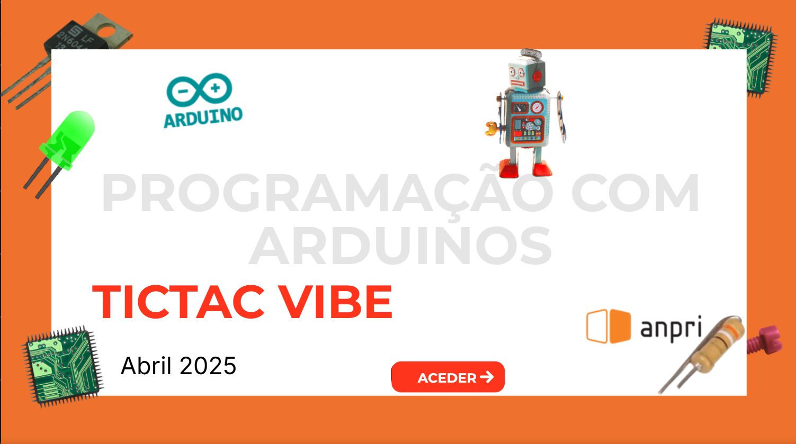

# TicTac Vibe

<a href="https://view.genially.com/680e87fab69828871ba6b0ab/interactive-content-programacao-com-arduinos">

  
Link para vídeo

</a>

  Projeto desenvolvido no âmbito da ação de formação - <b>Programação com Arduinos da ANPRI</b> (Associação de Professores de Informática) 
  <b>Créditos:</b> Anabela Angélico

